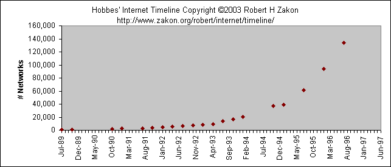
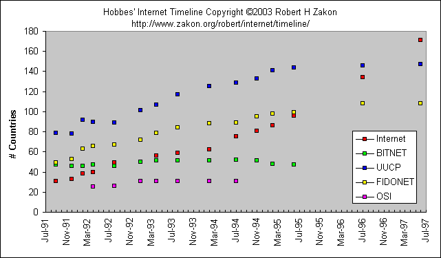
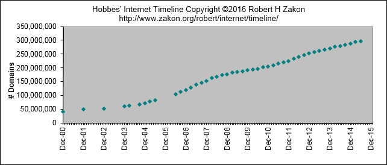
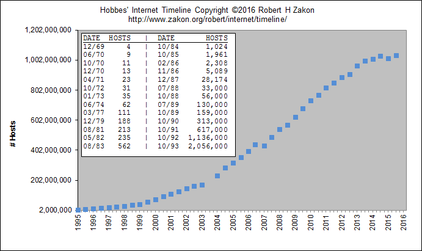
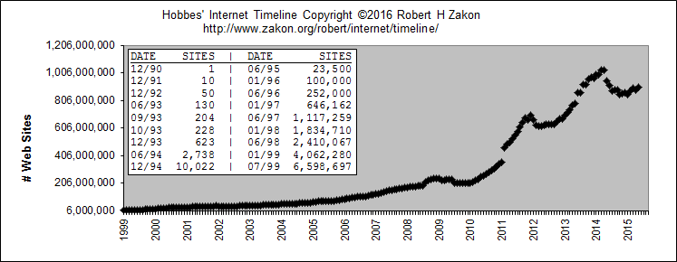
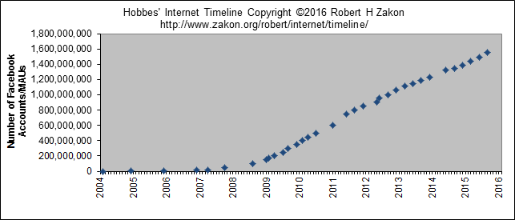

<!-- Geração automática de índice, inicio -->
<nav  markdown="1">

## Índice de tópicos
{:.no_toc}

1. Indice de Tópicos. Esta linha será substituída
{:toc}

</nav>
<!-- Geração automática de índice, fim -->

## Por década

### 1950s

1957
:  USSR launches Sputnik, first artificial earth satellite.
   In response, US forms the Advanced Research Projects Agency ([ARPA](http://www.darpa.mil/)),
   the following year,
   within the Department of Defense (DoD) to establish US lead in science and technology applicable to the military (:amk:)
{: .dl-traducao}

* * *

### 1960s

1961
:  Leonard Kleinrock, MIT: "[Information Flow in Large Communication Nets](http://www.lk.cs.ucla.edu/bibliography-public_reports.html)" (May 31)

    *  First paper on packet-switching (PS) theory
1962
:  J.C.R. Licklider & W. Clark, MIT: "[On-Line Man Computer Communication](http://portal.acm.org/citation.cfm?id=1460847)" (August)

    *  _Galactic Network_ concept encompassing distributed social interactions

1964
:  Paul Baran, RAND: "[On Distributed Communications Networks](http://www.rand.org/pubs/research_memoranda/RM3420.html)

    *  Packet-switching networks; no single outage point

1965
:  ARPA sponsors study on "cooperative network of time-sharing computers"

    *  TX-2 at MIT Lincoln Lab and AN/FSQ-32 at System Development Corporation (Santa Monica, CA) are directly linked (without packet switches) via a dedicated 1200bps phone line;
    Digital Equipment Corporation (DEC) computer at ARPA later added to form "The Experimental Network"

1966
: Lawrence G. Roberts, MIT: "Towards a Cooperative Network of Time-Shared Computers" (October)

  *  First ARPANET plan

1967
: ARPANET design discussions held by Larry Roberts at ARPA IPTO PI meeting in Ann Arbor, Michigan (April)
: [ACM](http://www.acm.org/) Symposium on Operating Systems Principles in Gatlinburg, Tennessee (October)

    *  First design paper on ARPANET published by Larry Roberts: "Multiple Computer Networks and Intercomputer Communication
    *  First meeting of the three independent packet network teams (RAND, NPL, ARPA)
: National Physical Laboratory (NPL) in Middlesex, England develops NPL Data Network under Donald Watts Davies who coins the term packet. The NPL network, an experiment in packet-switching, used 768kbps lines

1968
:  PS-network presented to the Advanced Research Projects Agency (ARPA)
: [Request for quotation](http://www.cs.utexas.edu/users/chris/DIGITAL_ARCHIVE/ARPANET/RFQ-ARPA-IMP.pdf) for ARPANET (29 Jul) sent out in August; responses received in September
:  University of California Los Angeles (UCLA) awarded Network Measurement Center contract in October
:  Network Working Group (NWG), headed by Steve Crocker, loosely organized to develop host level protocols for communication over the ARPANET. (:vgc:)
:  Tymnet built as part of Tymshare service (:vgc:)
1969
:  Bolt Beranek and Newman, Inc. (BBN) awarded Packet Switch contract to build Interface Message Processors (IMPs) in January
:  US Senator Edward Kennedy sends a congratulatory telegram to BBN for its million-dollar ARPA contract to build the "Interfaith" Message Processor, and thanking them for their ecumenical efforts
:  ARPANET commissioned by DoD for research into networking
:  Nodes are stood up as BBN builds each IMP [Honeywell DDP-516 mini computer with 12K of memory]; AT&T provides lines bundled to 50kbps
:  Node 1: UCLA (30 August, hooked up 2 September)

    *  _Function:_ Network Measurement Center
    *  _System,OS:_ SDS SIGMA 7, SEX
    *  [Diagram of the first host to IMP connection](http://www.computerhistory.org/internet_history/full_size_images/1969_2-node_map.gif)
:  Node 2: Stanford Research Institute (SRI) (1 October)

    *   Network Information Center (NIC)
    *   SDS940/Genie
    *   Doug Engelbart's project on "Augmentation of Human Intellect"
:  Node 3: University of California Santa Barbara (UCSB) (1 November)

    *   Culler-Fried Interactive Mathematics
    *   IBM 360/75, OS/MVT
:  Node 4: University of Utah (December)

    *   Graphics
    *   DEC PDP-10, Tenex
:  [Diagram of the 4-node ARPAnet](http://www.computerhistory.org/internet_history/full_size_images/1969_4-node_map.gif)
:  First Request for Comment (RFC): "[Host Software](http://www.faqs.org/rfcs/rfc1.html)" by Steve Crocker (7 April)
:  RFC 4: [Network Timetable](http://www.faqs.org/rfcs/rfc4.html)
:  First packets sent by Charley Kline at UCLA as he tried logging into SRI.
   The first attempt resulted in the system crashing as the letter G of LOGIN was entered.
   (October 29) [ [Log entry](http://www.computerhistory.org/internet_history/full_size_images/imp_log.jpg) ]
:  Univ of Michigan, Michigan State and Wayne State Univ establish X.25-based Merit network for students, faculty, alumni (:sw1:)
{: .dl-traducao}

* * *

### 1970s

1970
:  First publication of the original ARPANET Host-Host protocol: C.S. Carr,
   S. Crocker, V.G. Cerf, "HOST-HOST Communication Protocol in the ARPA Network,"
   in AFIPS Proceedings of SJCC (:vgc:)
:  First report on ARPANET at AFIPS: "Computer Network Development to Achieve Resource Sharing" (March)
:  ALOHAnet, the first packet radio network, developed by Norman Abramson,
   Univ of Hawaii, becomes operational (July) (:sk2:)

    *  connected to the ARPANET in 1972
:  ARPANET hosts start using Network Control Protocol (NCP), first host-to-host protocol
:  First cross-country link installed by AT&T between UCLA and BBN at 56kbps.
   This line is later replaced by another between BBN and RAND.
   A second line is added between MIT and Utah

1971
:  15 nodes (23 hosts): UCLA, SRI, UCSB, Univ of Utah, BBN, MIT, RAND, SDC, Harvard, Lincoln Lab, Stanford, UIU(C), CWRU, CMU, NASA/Ames
:  BBN starts building IMPs using the cheaper Honeywell 316.
   IMPs however are limited to 4 host connections, and so BBN develops a terminal IMP (TIP) that supports up to 64 terminals (September)
:  Ray Tomlinson of BBN invents email program to send messages across a distributed network.
   The original program was derived from two others:
   an intra-machine email program (SENDMSG) and an experimental file transfer program (CPYNET) (:amk:irh:)
:  Project Gutenberg is started by Michael Hart with the purpose of making copyright-free works,
   including books, electronically available.
   The first text is the US Declaration of Independence (:dhr,msh:)

1972
:  Ray Tomlinson (BBN) modifies email program for ARPANET where it becomes a quick hit.
   The @ sign was chosen from the punctuation keys on Tomlinson's Model 33 Teletype for its "at" meaning (March)
:  Larry Roberts writes first email management program (RD) to list,
   selectively read, file, forward, and respond to messages (July)
:  International Conference on Computer Communications (ICCC) at the Washington D.C.
   Hilton with demonstration of ARPANET between 40 machines and the Terminal Interface Processor (TIP) organized by Bob Kahn. (October)
:  First computer-to-computer chat takes place at UCLA, and is repeated during ICCC,
   as psychotic PARRY (at Stanford) discusses its problems with the Doctor (at BBN).
:  International Network Working Group (INWG) formed in October as a result of a meeting at ICCC identifying the need for a combined effort in advancing networking technologies.
   Vint Cerf appointed first Chair. By 1974, INWG became [IFIP](http://www.ifip.or.at/) WG 6.1 (:vgc:)
:  Louis Pouzin leads the French effort to build its own ARPANET - CYCLADES
:  RFC 318: [Telnet specification](http://www.faqs.org/rfcs/rfc318.html)

1973
:  First international connections to the ARPANET:
   University College of London (England) via [NORSAR](http://www.norsar.no/) (Norway)
:  Bob Metcalfe's Harvard PhD Thesis outlines idea for Ethernet.
   The concept was tested on Xerox PARC's Alto computers,
   and the first Ethernet network called the Alto Aloha System (May) (:amk:)
:  Bob Kahn poses Internet problem, starts Internetting research program at ARPA.
   Vinton Cerf sketches gateway architecture in March on back of envelope in a San Francisco hotel lobby (:vgc:)
:  Cerf and Kahn present basic Internet ideas at INWG in September at Univ of Sussex, Brighton, UK (:vgc:)
:  RFC 454: File Transfer specification
:  Network Voice Protocol (NVP) specification (RFC 741) and implementation enabling conference calls over ARPAnet. (:bb1:)
:  SRI (NIC) begins publishing ARPANET News in March; number of ARPANET users estimated at 2,000
:  ARPA study shows email composing 75% of all ARPANET traffic
:  Christmas Day Lockup - Harvard IMP hardware problem leads it to broadcast zero-length hops to any ARPANET destination,
   causing all other IMPs to send their traffic to Harvard (25 December)
:  RFC 527: [ARPAWOCKY](http://www.faqs.org/rfcs/rfc527.html)
:  RFC 602: [The Stockings Were Hung by the Chimney with Care](http://www.faqs.org/rfcs/rfc602.html)

1974
:  Vint Cerf and Bob Kahn publish "[A Protocol for Packet Network Intercommunication](http://www.cs.princeton.edu/courses/archive/fall06/cos561/papers/cerf74.pdf)"
   which specified in detail the design of a Transmission Control Program (TCP).
   [IEEE Trans Comm] (:amk:)
:  BBN opens Telenet, the first public packet data service (a commercial version of ARPANET) (:sk2:)

1975
:  Operational management of Internet transferred to DCA (now [DISA](http://www.disa.mil/))
:  First ARPANET mailing list, [MsgGroup](http://web.archive.org/web/20020209153802/www.tcm.org/msggroup/),
   is created by Steve Walker. Einar Stefferud soon took over as moderator as the list was not automated at first.
   A science fiction list, SF-Lovers, was to become the most popular unofficial list in the early days
:  John Vittal develops MSG, the first all-inclusive email program providing replying,
   forwarding, and filing capabilities.
:  Satellite links cross two oceans (to Hawaii and UK) as the first TCP tests are run over them by Stanford, BBN, and UCL
:  "[Jargon File](http://catb.org/~esr/jargon/html/)", by Raphael Finkel at SAIL, first released (:esr:)
:  Shockwave Rider by John Brunner (:pds:)

1976
:  Elizabeth II, Queen of the United Kingdom sends out an email on 26 March from the Royal Signals and Radar Establishment (RSRE) in Malvern
:  UUCP (Unix-to-Unix CoPy) developed at AT&T Bell Labs and distributed with [UNIX](http://www.columbia.edu/~rh120/ch001j.c11) one year later.
:  Multiprocessing Pluribus IMPs are deployed

1977
:  THEORYNET created by Larry Landweber at Univ of Wisconsin providing electronic mail to over 100 researchers in computer science (using a locally developed email system over TELENET)
:  RFC 733: [Mail specification](http://www.faqs.org/rfcs/rfc733.html)
:  Tymshare spins out Tymnet under pressure from TELENET.
   Both go on to develop X.25 protocol standard for virtual circuit style packet switching (:vgc:)
:  First demonstration of ARPANET/SF Bay Packet Radio Net/Atlantic SATNET operation of Internet protocols with BBN-supplied gateways in July (:vgc:)

1978
:  TCP split into TCP and IP (March)
:  Possibly the first commercial [spam message](http://www.templetons.com/brad/spamreact.html#msg)
   is sent on 1 May by a DEC marketer advertising an upcoming presentation of its new DECSYSTEM-20 computers
:  RFC 748: [TELNET RANDOMLY-LOSE Option](http://www.faqs.org/rfcs/rfc748.html)

1979
:  Meeting between Univ of Wisconsin, DARPA, [National Science Foundation](http://www.nsf.gov/) (NSF),
   and computer scientists from many universities to establish a Computer Science Department research computer network (organized by Larry Landweber).
:  USENET established using UUCP between Duke and UNC by Tom Truscott, Jim Ellis, and Steve Bellovin.
   All original groups were under NET.* hierarchy.
:  First MUD, MUD1, by Richard Bartle and Roy Trubshaw at U of Essex
:  ARPA establishes the Internet Configuration Control Board (ICCB)
:  Packet Radio Network (PRNET) experiment starts with DARPA funding.
   Most communications take place between mobile vans. ARPANET connection via SRI.
:  On April 12, Kevin MacKenzie emails the MsgGroup a suggestion of adding some emotion back into the dry text medium of email, such as -) for indicating a sentence was tongue-in-cheek.
   Though flamed by many at the time, emoticons became widely used after Scott Fahlman suggested the use of :-) and :-( in a CMU BBS on 19 September 1982
{: .dl-traducao}

* * *

### 1980s

1980
:  ARPANET grinds to a complete halt on 27 October because of an accidentally-propagated status-message virus
:  First C/30-based IMP at BBN

1981
:  [BITNET](http://www.cren.net/cren/history.html), the "Because It's Time NETwork"

    *  Started as a cooperative network at the City University of New York, with the first connection to Yale (:feg:)
    *  Original acronym stood for 'There' instead of 'Time' in reference to the free NJE protocols provided with the IBM systems
    *  Provides electronic mail and listserv servers to distribute information, as well as file transfers

:  CSNET (Computer Science NETwork) built by a collaboration of computer scientists and Univ of Delaware,
   Purdue Univ, Univ of Wisconsin, RAND Corporation and BBN through seed money granted by NSF to provide networking services (especially email) to university scientists with no access to ARPANET. CSNET later becomes known as the Computer and Science Network. (:amk,lhl:)
:  C/30 IMPs predominate the network; first C/30 TIP at SAC
:  Minitel (Teletel) is deployed across France by France Telecom.
:  True Names by Vernor Vinge (:pds:)
:  RFC 801: [NCP/TCP Transition Plan](http://www.faqs.org/rfcs/rfc801.html)

1982
:  Norway leaves network to become an Internet connection via TCP/IP over SATNET; UCL does the same
:  DCA and ARPA establish the Transmission Control Protocol (TCP) and Internet Protocol (IP),
   as the protocol suite, commonly known as TCP/IP, for ARPANET. (:vgc:)

    *  This leads to one of the first definitions of an "internet" as a connected set of networks,
       specifically those using TCP/IP, and "Internet" as connected TCP/IP internets.
    *  DoD declares TCP/IP suite to be standard for DoD (:vgc:)
:  EUnet (European UNIX Network) is created by EUUG to provide email and USENET services. (:glg:)
    *  original connections between the Netherlands, Denmark, Sweden, and UK
:  Exterior Gateway Protocol (RFC 827) specification. EGP is used for gateways between networks.

1983
:  Name server developed at Univ of Wisconsin, no longer requiring users to know the exact path to other systems
:  Cutover from NCP to TCP/IP (1 January)
:  No more Honeywell or Pluribus IMPs; TIPs replaced by TACs (terminal access controller)
:  Stuttgart and Korea get connected
:  Movement Information Net (MINET) started early in the year in Europe, connected to Internet in Sept
:  CSNET / ARPANET gateway put in place
:  ARPANET split into ARPANET and MILNET;
   the latter became integrated with the Defense Data Network created the previous year. 68 of the 113 existing nodes went to MILNET
:  Desktop workstations come into being, many with Berkeley UNIX (4.2 BSD) which includes IP networking software (:mpc:)
:  Networking needs switch from having a single,
   large time sharing computer connected to the Internet at each site,
   to instead connecting entire local networks
:  [Internet Activities Board (IAB)](http://www.iab.org/) established, replacing ICCB
:  EARN (European Academic and Research Network) established.
   Very similar to the way BITNET works with a gateway funded by IBM-Europe
:  FidoNet developed by Tom Jennings

1984
:  Domain Name System (DNS) introduced
:  Number of hosts breaks 1,000
:  JUNET (Japan Unix Network) established using UUCP
:  JANET (Joint Academic Network) established in the UK using the Coloured Book protocols; previously SERCnet
:  Moderated newsgroups introduced on USENET (mod.*)
:  Neuromancer by William Gibson
:  Canada begins a one-year effort to network its universities.
   The NetNorth Network is connected to BITNET in Ithaca from Toronto (:kf1:)
:  [Kremvax](http://groups.google.com/groups?selm=0001%40kremvax.UUCP) message announcing USSR connectivity to USENET

1985
:  Whole Earth 'Lectronic Link (WELL) started
:  Information Sciences Institute (ISI) at USC is given responsibility for DNS root management by DCA,
   and SRI for DNS NIC registrations
:  Symbolics.com is assigned on 15 March to become the first registered domain.
   Other firsts: cmu.edu, purdue.edu, rice.edu, berkeley.edu, ucla.edu, rutgers.edu, bbn.com (24 Apr);
   mit.edu (23 May); think.com (24 may); css.gov (June); mitre.org, .uk (July)
:  100 years to the day of the last spike being driven on the cross-Canada railroad,
   the last Canadian university is connected to NetNorth in a one year effort to have coast-to-coast connectivity. (:kf1:)
:  RFC 968: ['Twas the Night Before Start-up](http://www.faqs.org/rfcs/rfc968.html)
:  NSFNET created (backbone speed of 56Kbps)

    *  NSF establishes 5 super-computing centers to provide high-computing power for all (JVNC@Princeton, PSC@Pittsburgh, SDSC@UCSD, NCSA@UIUC, Theory Center@Cornell).
    *  This allows an explosion of connections, especially from universities.
:  NSF-funded SDSCNET, JVNCNET, SURANET, and NYSERNET operational (:sw1:)
:  [Internet Engineering Task Force (IETF)](http://www.ietf.org)
   and Internet Research Task Force (IRTF) comes into existence under the IAB.
   First IETF meeting held in January at Linkabit in San Diego
:  The first Freenet (Cleveland) comes on-line 16 July under the auspices of the Society for Public Access Computing (SoPAC).
   Later Freenet program management assumed by the National Public Telecomputing Network (NPTN) in 1989 (:sk2,rab:)
:  Network News Transfer Protocol (NNTP) designed to enhance Usenet news performance over TCP/IP.
:  Mail Exchanger (MX) records developed by Craig Partridge allow non-IP network hosts to have domain addresses.
:  The first in a series of congestion collapses begin occurring in October. (:jtl:)
:  The great USENET name change; moderated newsgroups changed in 1987.
:  BARRNET (Bay Area Regional Research Network) established using high speed links. Operational in 1987.
:  New England gets cut off from the Net as AT&T suffers a fiber optics cable break between Newark/NJ and White Plains/NY.
   Yes, all seven New England ARPANET trunk lines were in the one severed cable. Outage took place between 1:11 and 12:11 EST on 12 December
:  .fi is registered by members of the Finnish Unix User Group (FUUG) in Tampere (12 Dec)

1987
:  NSF signs a cooperative agreement to manage the NSFNET backbone with Merit Network, Inc.
   (IBM and MCI involvement was through an agreement with Merit). Merit, IBM, and MCI later founded ANS.
:  UUNET is founded with Usenix funds to provide commercial UUCP and Usenet access.
   Originally an experiment by Rick Adams and Mike O'Dell
:  First TCP/IP Interoperability Conference (March), name changed in 1988 to INTEROP
:  Email link established between Germany and China using CSNET protocols,
   with the first message from China sent on 20 September. (:wz1:)
:  The concept and plan for a national US research and education network is proposed by Gordon Bell et al in a report to the Office of Science and Technology,
   written in response to a congressional request by Al Gore. (Nov) It would take four years until the establishment of this network by Congress (:gb1:)
:  [1000th RFC](http://www.faqs.org/rfcs/rfc1000.html): "Request For Comments reference guide"
:  Number of hosts breaks 10,000
:  Number of BITNET hosts breaks 1,000

1988
:  2 November - Internet worm burrows through the Net, affecting ~6,000 of the 60,000 hosts on the Internet (:ph1:)
:  CERT (Computer Emergency Response Team) formed by DARPA in response to the needs exhibited during the Morris worm incident.
   The worm is the only advisory issued this year.
:  DoD chooses to adopt OSI and sees use of TCP/IP as an interim.
   US Government OSI Profile (GOSIP) defines the set of protocols to be supported by Government purchased products (:gck:)
:  Los Nettos network created with no federal funding, instead supported by regional members
   (founding: Caltech, TIS, UCLA, USC, ISI).
:  NSFNET backbone upgraded to T1 (1.544Mbps)
:  CERFnet (California Education and Research Federation network) founded by Susan Estrada.
:  Internet Assigned Numbers Authority (IANA) established in December with Jon Postel as its Director.
   Postel was also the RFC Editor and US Domain registrar for many years.
:  Internet Relay Chat (IRC) developed by Jarkko Oikarinen (:zby:)
:  First Canadian regionals join NSFNET: ONet via Cornell, RISQ via Princeton, BCnet via Univ of Washington (:ec1:)
:  FidoNet gets connected to the Net, enabling the exchange of email and news (:tp1:)
:  The first multicast tunnel is established between Stanford and BBN in the Summer of 1988.
:  Countries connecting to NSFNET: Canada (CA), Denmark (DK), France (FR), Iceland (IS), Norway (NO), Sweden (SE)

1989
:  Number of hosts breaks 100,000
:  [RIPE](http://www.ripe.net/) (Reseaux IP Europeens) formed (by European service providers)
   to ensure the necessary administrative and technical coordination to allow the operation of the pan-European IP Network. (:glg:)
:  First relays between a commercial electronic mail carrier and the Internet:
   MCI Mail through the Corporation for the National Research Initiative (CNRI),
   and CompuServe through Ohio State Univ (:jg1,ph1:)
:  Corporation for Research and Education Networking ([CREN](http://www.cren.net/))
   is formed by merging CSNET into BITNET (August)
:  AARNET - Australian Academic Research Network - set up by AVCC and CSIRO;
   introduced into service the following year (:gmc:)
:  First link between Australia and NSFNET via Hawaii on 23 June.
   Australia had been limited to USENET access since the early 1980s
:  Cuckoo's Egg by Clifford Stoll tells the real-life tale of a German cracker group who infiltrated numerous US facilities
:  UCLA sponsors the Act One symposium to celebrate ARPANET's 20th anniversary and its decommissioning (August)
:  RFC 1121: [Act One - The Poems](http://www.faqs.org/rfcs/rfc1121.html)
:  RFC 1097: [TELNET SUBLIMINAL-MESSAGE Option](http://www.faqs.org/rfcs/rfc1097.html)
:  Countries connecting to NSFNET: Australia (AU), Germany (DE), Israel (IL),
   Italy (IT), Japan (JP), Mexico (MX), Netherlands (NL), New Zealand (NZ),
  Puerto Rico (PR), United Kingdom (UK)
{: .dl-traducao}

* * *

### 1990s

1990
:  ARPANET ceases to exist
:  [Electronic Frontier Foundation (EFF)](http://www.eff.org/) is founded by Mitch Kapor
:  Archie released by Peter Deutsch, Alan Emtage, and Bill Heelan at McGill
:  Hytelnet released by Peter Scott (Univ of Saskatchewan)
:  The World comes on-line (world.std.com), becoming the first commercial provider of Internet dial-up access
:  ISO Development Environment (ISODE) developed to provide an approach for OSI migration for the DoD.
   ISODE software allows OSI application to operate over TCP/IP (:gck:)
:  CA*net formed by 10 regional networks as national Canadian backbone with direct connection to NSFNET (:ec1:)
:  The first remotely operated machine to be hooked up to the Internet,
   the Internet Toaster by John Romkey, (controlled via SNMP) makes its debut at Interop.
:  Czechoslovakia (.cs) connects to EARN/BitNet (11 Oct); .cs deleted in 1993
:  RFC 1149: [A Standard for the Transmission of IP Datagrams on Avian Carriers](http://www.faqs.org/rfcs/rfc1149.html).  [Implementation](http://www.blug.linux.no/rfc1149/) is completed 11 years later by the Bergen Linux Users Group (28 Apr 2001)
:  RFC 1178: [Choosing a Name for Your Computer](http://www.faqs.org/rfcs/rfc1178.html)
:  Countries connecting to NSFNET: Argentina (AR), Austria (AT), Belgium (BE),
   Brazil (BR), Chile (CL), Greece (GR), India (IN), Ireland (IE), Korea (KR),
   Spain (ES), Switzerland (CH).

1991
:  First connection takes place between Brazil, by Fapesp, and the Internet at 9600 baud.
:  Commercial Internet eXchange (CIX) Association, Inc. formed by General Atomics (CERFnet),
   Performance Systems International, Inc. (PSInet), and UUNET Technologies, Inc. (AlterNet),
   as NSF lifts restrictions on the commercial use of the Net (March) (:glg:)
:  Wide Area Information Servers (WAIS), invented by Brewster Kahle,
   released by Thinking Machines Corporation
:  Gopher released by Paul Lindner and Mark P. McCahill from the Univ of Minnesota
:  [World-Wide Web (WWW)](http://www.w3.org/History/) released by [CERN](http://www.cern.ch/);
   Tim Berners-Lee developer (:pb1:). First Web server is nxoc01.cern.ch,
   launched in Nov 1990 and later renamed info.cern.ch.
:  PGP (Pretty Good Privacy) released by Philip Zimmerman (:ad1:)
:  US High Performance Computing Act (Gore 1) establishes the National Research and Education Network (NREN)
:  NSFNET backbone upgraded to T3 (44.736Mbps)
:  NSFNET traffic passes 1 trillion bytes/month and 10 billion packets/month
:  Defense Data Network NIC contract awarded by DISA to Government Systems Inc. who takes over from SRI on 1 Oct
:  Start of JANET IP Service (JIPS) which signaled the changeover from Coloured Book software to TCP/IP within the UK academic network. IP was initially 'tunneled' within X.25\. (:gst:)
:  RFC 1216: [Gigabit Network Economics and Paradigm Shifts](http://www.faqs.org/rfcs/rfc1216.html)
:  RFC 1217: [Memo from the Consortium for Slow Commotion Research (CSCR)](http://www.faqs.org/rfcs/rfc1217.html)
:  Countries connecting to NSFNET: Croatia (HR), Hong Kong (HK), Hungary (HU), Poland (PL), Portugal (PT), Singapore (SG), South Africa (ZA), Taiwan (TW), Tunisia (TN)

1992
:  Internet Society (ISOC) is chartered (January)
:  IAB reconstituted as the Internet Architecture Board and becomes part of the Internet Society
:  Number of hosts breaks 1,000,000
:  First MBONE audio multicast (March) and video multicast (November)
:  [RIPE](http://www.ripe.net/) Network Coordination Center (NCC) created in April to
   provide address registration and coordination services to the European Internet community (:dk1:)
:  Veronica, a gopherspace search tool, is released by Univ of Nevada
:  [World Bank](http://www.worldbank.org/) comes on-line
:  The term "[surfing the Internet](http://www.netmom.com/about-net-mom/26-surfing-the-internet.html)"
   is coined by Jean Armour Polly (:jap:); Brendan Kehoe uses the term "net-surfing" as early as 6 June 1991
   in a [USENET post](http://groups-beta.google.com/group/comp.admin.policy/msg/4c76bb41a52c2347?dmode=source) (:bt1:)
:  [Zen and the Art of the Internet](http://www.cs.indiana.edu/docproject/zen/zen-1.0_toc.html) is published by Brendan Kehoe (:jap:)
:  Internet Hunt started by Rick Gates
:  RFC 1300: [Remembrances of Things Past](http://www.faqs.org/rfcs/rfc1300.html)
:  RFC 1313: [Today's Programming for KRFC AM 1313 - Internet Talk Radio](http://www.faqs.org/rfcs/rfc1313.html)
:  Countries connecting to NSFNET: Antarctica (AQ), Cameroon (CM), Cyprus (CY),
   Ecuador (EC), Estonia (EE), Kuwait (KW), Latvia (LV), Luxembourg (LU), Malaysia (MY),
   Slovenia (SI), Thailand (TH), Venezuela (VE)

1993
:  [InterNIC](http://www.internic.net/) created by NSF to provide specific Internet services: (:sc1:)
    *  directory and database services (AT&T)
    *  registration services (Network Solutions Inc.)
    *  information services (General Atomics/CERFnet)
:  US White House email comes on-line at whitehouse.gov; [web site](http://clinton1.nara.gov/) launches in 1994
    *  President Bill Clinton: president@whitehouse.gov
    *  Vice-President Al Gore: vice-president@whitehouse.gov
:  Worms of a new kind find their way around the Net - WWW Worms (W4), joined by Spiders, Wanderers, Crawlers, and Snakes ...
:  Internet Talk Radio begins broadcasting (:sk2:)
:  [United Nations](http://www.un.org/) (UN) comes on-line (:vgc:)
:  US National Information Infrastructure Act
:  Businesses and media begin taking notice of the Internet
:  .sk (Slovakia) and .cz (Czech Republic) created after split of Czechoslovakia; .cs decomissioned
:  InterCon International KK (IIKK) provides Japan's first commercial Internet connection in September.
   TWICS, though an IIKK leased line, begins offering dial-up accounts the following month (:tb1:)
:  Mosaic takes the Internet by storm (22 Apr);
   WWW proliferates at a 341,634% annual growth rate of service traffic.
   Gopher's growth is 997%.
:  RFC 1437: [The Extension of MIME Content-Types to a New Medium](http://www.faqs.org/rfcs/rfc1437.html)
:  RFC 1438: [IETF Statements of Boredom (SOBs)](http://www.faqs.org/rfcs/rfc1438.html)
:  Countries connecting to NSFNET: Bulgaria (BG), Costa Rica (CR), Egypt (EG),
   Fiji (FJ), Ghana (GH), Guam (GU), Indonesia (ID), Kazakhstan (KZ), Kenya (KE),
   Liechtenstein (LI), Peru (PE), Romania (RO), Russian Federation (RU),
   Turkey (TR), Ukraine (UA), UAE (AE), US Virgin Islands (VI)

1994
:  ARPANET/Internet celebrates 25th anniversary
:  Communities begin to be wired up directly to the Internet (Lexington and Cambridge, Mass., USA)
:  US [Senate](http://www.senate.gov/) and [House](http://www.house.gov/) provide information servers
:  Shopping malls arrive on the Internet
:  First cyberstation, RT-FM, broadcasts from Interop in Las Vegas
:  The National Institute for Standards and Technology (NIST) suggests that GOSIP should incorporate TCP/IP and drop the "OSI-only" requirement (:gck:)
:  Arizona law firm of [Canter & Siegel](ftp://d.armory.com/pub/user/leavitt/html/cands.report.html) "spams" the Internet with email advertising green card lottery services; Net citizens flame back
:  NSFNET traffic passes 10 trillion bytes/month
:  Yes, it's true - you can now order pizza from the Hut online
:  WWW edges out telnet to become 2nd most popular service on the Net (behind ftp-data)
   based on % of packets and bytes traffic distribution on NSFNET
:  Japanese Prime Minister on-line ([http://www.kantei.go.jp/](http://www.kantei.go.jp/))
:  UK's HM Treasury on-line ([http://www.hm-treasury.gov.uk/](http://www.hm-treasury.gov.uk/))
:  New Zealand's Info Tech Prime Minister on-line ([http://www.govt.nz/](http://www.govt.nz/))
:  First Virtual, the first cyberbank, open up for business
:  Radio stations start rockin' (rebroadcasting) round the clock on the Net:
   WXYC at Univ of NC, KJHK at Univ of KS-Lawrence, KUGS at Western WA Univ
:  IPng recommended by IETF at its Toronto meeting (July) and approved by IESG in November. Later documented as RFC 1752
:  The first banner ads appear on hotwired.com in October. They were for Zima (a beverage) and AT&T
:  Trans-European Research and Education Network Association ([TERENA](http://www.terena.org)) is formed by the merger of RARE and EARN,
   with representatives from 38 countries as well as [CERN](http://www.cern.ch/)
   and ECMWF.TERENA's aim is to "promote and participate in the development of a high quality international information and telecommunications infrastructure for the benefit of research and education" (October)
:  After noticing that many network software vendors used domain.com in their documentation examples,
   Bill Woodcock and Jon Postel register the domain.
   Sure enough, after looking at the domain access logs, it was evident that many users were using the example domain in configuring their applications.
:  The first web-based machine translation system is developed by this Timeline's author,
   supporting 9 languages, and made available the following year to hundreds of thousands of users on OSIS and Intelink,
   both US government networks
:  RFC 1605: [SONET to Sonnet Translation](http://www.faqs.org/rfcs/rfc1605.html)
:  RFC 1606: [A Historical Perspective On The Usage Of IP Version 9](http://www.faqs.org/rfcs/rfc1606.html)
:  RFC 1607: [A VIEW FROM THE 21ST CENTURY](http://www.faqs.org/rfcs/rfc1607.html)
:  Countries connecting to NSFNET: Algeria (DZ), Armenia (AM), Bermuda (BM),
   Burkina Faso (BF), China (CN), Colombia (CO), Jamaica (JM), Jordan (JO),
   Lebanon (LB), Lithuania (LT), Macao (MO), Morocco (MA), New Caledonia (NC),
   Nicaragua (NI), Niger (NE), Panama (PA), Philippines (PH), Senegal (SN),
   Sri Lanka (LK), Swaziland (SZ), Uruguay (UY), Uzbekistan (UZ)
:  Top 10 Domains by Host #: com, edu, uk, gov, de, ca, mil, au, org, net

1995
:  NSFNET reverts back to a research network.
   Main US backbone traffic now routed through interconnected network providers
:  The new NSFNET is born as NSF establishes the very high speed Backbone Network Service (vBNS) linking super-computing centers: NCAR, NCSA, SDSC, CTC, PSC
:  Neda Rayaneh Institute (NRI), Iran's first commercial provider, comes online,
   connecting via satellite to Cadvision, a Canadian provider (:rm1:)
:  Hong Kong police disconnect all but one of the colony's Internet providers for failure to obtain a license;
   thousands of users are left without service (:kf2:)
:  Sun launches JAVA on May 23
:  RealAudio, an audio streaming technology, lets the Net hear in near real-time
:  Radio HK, the first commercial 24 hr., Internet-only radio station starts broadcasting
:  WWW surpasses ftp-data in March as the service with greatest traffic on NSFNet based on packet count,
   and in April based on byte count
:  Traditional online dial-up systems ([CompuServe](http://www.compuserve.com/),
   [America Online](http://www.aol.com/), Prodigy) begin to provide Internet access
:  Chris Lamprecht (aka "Minor Threat") becomes the first person banned from accessing the Internet by a US District Court judge in Texas
:  Thousands in Minneapolis-St. Paul (USA) lose Net access after transients start a bonfire under a bridge at the Univ of MN causing fiber-optic cables to melt (30 July)
:  A number of Net related companies go public, with Netscape leading the pack with the 3rd largest ever NASDAQ IPO share value (9 August)
:  Registration of domain names is no longer free.
   Beginning 14 September, a $50 annual fee has been imposed, which up until now was subsidized by NSF.
   NSF continues to pay for .edu registration, and on an interim basis for .gov
:  The Vatican comes on-line ([http://www.vatican.va/](http://www.vatican.va/))
:  The Canadian Government comes on-line ([http://canada.gc.ca/](http://canada.gc.ca/))
:  The first official Internet wiretap was successful in helping the Secret Service and Drug Enforcement Agency (DEA)
   apprehend three individuals who were illegally manufacturing and selling cell phone cloning equipment and electronic devices
:  Operation Home Front connects, for the first time,
   soldiers in the field with their families back home via the Internet.
:  Richard White becomes the first person to be declared a munition,
   under the USA's arms export control laws, because of an RSA file security encryption program tattooed on his arm (:wired496:)
:  RFC 1882: [The 12-Days of Technology Before Christmas](http://www.faqs.org/rfcs/rfc1882.html)
:  Country domains registered: Ethiopia (ET), Cote d'Ivoire (CI),
   Cook Islands (CK) Cayman Islands (KY), Anguilla (AI), Gibraltar (GI),
   Vatican (VA), Kiribati (KI), Kyrgyzstan (KG), Madagascar (MG),
   Mauritius (MU), Micronesia (FM), Monaco (MC), Mongolia (MN), Nepal (NP),
   Nigeria (NG), Western Samoa (WS), San Marino (SM), Tanzania (TZ),
   Tonga (TO), Uganda (UG), Vanuatu (VU)
:  Top 10 Domains by Host #: com, edu, net, gov, mil, org, de, uk, ca, au
:  _Technologies of the Year:_ WWW, Search engines
:  _Emerging Technologies:_ Mobile code (JAVA, JAVAscript), Virtual environments (VRML), Collaborative tools
:  _Hacks of the Year:_ The Spot (Jun 12), Hackers Movie Page (12 Aug)

1996
:  Internet phones catch the attention of US telecommunication companies who ask
   the US Congress to ban the technology (which has been around for years)
:  Malaysian Prime Minister Mahathir Mohamad, PLO Leader Yasser Arafat,
   and Phillipine President Fidel Ramos meet for ten minutes in an online interactive chat session on 17 January.
:  The controversial US Communications Decency Act (CDA) becomes law in the US in order to prohibit distribution of indecent materials over the Net.
   A few months later a three-judge panel imposes an injunction against its enforcement. Supreme Court unanimously rules most of it unconstitutional in 1997.
:  BackRub, Google's precursor, comes online
:  9,272 organizations find themselves unlisted after the InterNIC drops their name service as a result of not having paid their domain name fee
:  Various ISPs suffer extended service outages,
   bringing into question whether they will be able to handle the growing number of users.
   AOL (19 hours), Netcom (13 hours), AT&T WorldNet (28 hours - email only)
:  Domain name tv.com sold to CNET for US$15,000
:  New York's Public Access Networks Corp (PANIX) is shut down after repeated SYN attacks by a cracker using methods outlined in a hacker magazine ([2600](http://www.2600.org))
:  MCI upgrades Internet backbone adding ~13,000 ports, bringing the effective speed from 155Mbps to 622Mbps.
:  The Internet Ad Hoc Committee announces plans to add 7 new generic Top Level Domains (gTLD):
  .firm, .store, .web, .arts, .rec, .info, .nom.
  The IAHC plan also calls for a competing group of domain registrars worldwide.
:  A malicious cancelbot is released on USENET wiping out more than 25,000 messages
:  The WWW browser war, fought primarily between Netscape and Microsoft,
   has rushed in a new age in software development,
   whereby new releases are made quarterly with the help of Internet users eager to test upcoming (beta) versions.
:  Internet2 project is kicked off by representatives from 34 universities on 1 Oct (:msb:)
:  RFC 1925: [The Twelve Networking Truths](http://www.faqs.org/rfcs/rfc1925.html)
:  Restrictions on Internet use around the world:

    *  _China:_ requires users and ISPs to register with the police
    *  _Germany:_ cuts off access to some newsgroups carried on CompuServe
    *  _Saudi Arabia:_ confines Internet access to universities and hospitals
    *  _Singapore:_ requires political and religious content providers to register with the state
    *  _New Zealand_: classifies computer disks as "publications" that can be censored and seized
    *  _source: Human Rights Watch_

:  Country domains registered: Qatar (QA), Central African Republic (CF),
   Oman (OM), Norfolk Island (NF), Tuvalu (TV), French Polynesia (PF),
   Syria (SY), Aruba (AW), Cambodia (KH), French Guiana (GF), Eritrea (ER),
   Cape Verde (CV), Burundi (BI), Benin (BJ) Bosnia-Herzegovina (BA),
   Andorra (AD), Guadeloupe (GP), Guernsey (GG), Isle of Man (IM), Jersey (JE),
   Lao (LA), Maldives (MV), Marshall Islands (MH), Mauritania (MR),
   Northern Mariana Islands (MP), Rwanda (RW), Togo (TG), Yemen (YE), Zaire (ZR)
:  Top 10 Domains by Host #: com, edu, net, uk, de, jp, us, mil, ca, au
:  _Hacks of the Year:_ US Dept of Justice (17 Aug), CIA (19 Sep), Air Force (29 Dec),
   UK Labour Party (6 Dec), NASA DDCSOL - USAFE - US Air Force (30 Dec)
:  _Technologies of the Year:_ Search engines, JAVA, Internet Phone
:  _Emerging Technologies:_ Virtual environments (VRML), Collaborative tools, Internet appliance (Network Computer)

1997
:  [2000th RFC](http://www.faqs.org/rfcs/rfc2000.html): "Internet Official Protocol Standards"
:  71,618 mailing lists registered at Liszt, a mailing list directory
:  The [American Registry for Internet Numbers (ARIN)](http://www.arin.net/)
   is established to handle administration and registration of IP numbers to the geographical areas currently handled by Network Solutions (InterNIC),
   starting March 1998.
:  CA*net II launched in June to provide Canada's next generation Internet using ATM/SONET
:  In protest of the DNS monopoly, AlterNIC's owner, Eugene Kashpureff, hacks DNS so users going to www.internic.net end up at www.alternic.net
:  Domain name business.com sold for US$150,000
:  Early in the morning of 17 July, human error at Network Solutions causes the DNS table for .com and .net domains to become corrupted, making millions of systems unreachable.
:  Longest hostname registered with InterNIC: CHALLENGER.MED.SYNAPSE.UAH.UALBERTA.CA
:  101,803 Name Servers in whois database
:  RFC 2100: [The Naming of Hosts](http://www.faqs.org/rfcs/rfc2100.html)
:  Country domains registered: Falkland Islands (FK), East Timor (TP),
   R of Congo (CG), Christmas Island (CX), Gambia (GM), Guinea-Bissau (GW),
   Haiti (HT), Iraq (IQ), Libya (LY), Malawi (MW), Martinique (MQ),
   Montserrat (MS), Myanmar (MM), French Reunion Island (RE), Seychelles (SC),
   Sierra Leone (SL), Somalia (SO), Sudan (SD), Tajikistan (TJ),
   Turkmenistan (TM), Turks and Caicos Islands (TC),
   British Virgin Islands (VG), Heard and McDonald Islands (HM),
   French Southern Territories (TF), British Indian Ocean Territory (IO),
   Svalbard and Jan Mayen Islands (SJ), St Pierre and Miquelon (PM),
   St Helena (SH), South Georgia/Sandwich Islands (GS),
   Sao Tome and Principe (ST), Ascension Island (AC),
   US Minor Outlying Islands (UM), Mayotte (YT),
   Wallis and Futuna Islands (WF), Tokelau Islands (TK), Chad Republic (TD),
   Afghanistan (AF), Cocos Island (CC), Bouvet Island (BV), Liberia (LR),
   American Samoa (AS), Niue (NU), Equatorial New Guinea (GQ), Bhutan (BT),
   Pitcairn Island (PN), Palau (PW), DR of Congo (CD)
:  Top 10 Domains by Host #: com, edu, net, jp, uk, de, us, au, ca, mil
:  _Hacks of the Year:_ Indonesian Govt (19 Jan, 10 Feb, 24 Apr,
   30 Jun, 22 Nov), NASA (5 Mar), UK Conservative Party (27 Apr), Spice Girls (14 Nov)
:  _Technologies of the Year:_ Push, Multicasting
:  _Emerging Technologies:_ Push

1998
:  _Hobbes' Internet Timeline_ is released as [RFC 2235](http://www.faqs.org/rfcs/rfc2235.html) & FYI 32
:  US Depart of Commerce (DoC) releases the [Green Paper](http://www.ntia.doc.gov/ntiahome/domainname/dnsdrft.htm) outlining its plan to privatize DNS on 30 January.
   This is followed up by a [White Paper](http://www.ntia.doc.gov/ntiahome/domainname/6_5_98dns.htm) on June 5
:  [La Fête de l'Internet](http://www.fete-internet.fr/), a country-wide Internet fest, is held in France 20-21 March
:  Web size estimates range between 275 (Digital) and 320 (NEC) million pages for 1Q
:  Companies flock to the Turkmenistan NIC in order to register their name under the .tm domain, the English abbreviation for trademark
:  Internet users get to be judges in a performance by 12 world champion ice skaters on 27 March, marking the first time a television sport show's outcome is determined by its viewers.
:  Network Solutions registers its 2 millionth domain on 4 May
:  Electronic postal stamps become a reality, with the [US Postal Service](http://www.usps.gov/) allowing stamps to be purchased and downloaded for printing from the Web.
:  Canada kicks off CA*net 3, the first national optical internet
:  CDA II and a ban on Net taxes are signed into US law (21 October)
:  ABCNews.com accidentally posts test US election returns one day early (2 November)
:  Indian ISP market is deregulated in November causing a rush for ISP operation licenses
:  US DoC enters into an [agreement](http://www.ntia.doc.gov/ntiahome/domainname/icann-memorandum.htm)
   with the [Internet Corporation for Assigned Numbers (ICANN)](http://www.icann.org/)
   to establish a process for transitioning DNS from US Government management to industry (25 November)
:  San Francisco sites without off-city mirrors go offline as the city blacks out on 8 December
:  Chinese government puts Lin Hai on trial for "inciting the overthrow of state power"
   for providing 30,000 email addresses to a US Internet magazine (December)
   [ He is later sentenced to two years in jail ]
:  French Internet users give up their access on 13 December to boycott France Telecom's local phone charges (which are in addition to the ISP charge)
:  US$1M+ Domain Sales: Altavista.com (3.3M) to Compaq
:  Open source software comes of age
:  RFC 2321: [RITA -- The Reliable Internetwork Troubleshooting Agent](http://www.faqs.org/rfcs/rfc2321.html)
:  RFC 2322: [Management of IP numbers by peg-dhcp](http://www.faqs.org/rfcs/rfc2322.html)
:  RFC 2323: [IETF Identification and Security Guidelines](http://www.faqs.org/rfcs/rfc2323.html)
:  RFC 2324: [Hyper Text Coffee Pot Control Protocol (HTCPCP/1.0)](http://www.faqs.org/rfcs/rfc2324.html)
:  Country domains registered: Nauru (NR), Comoros (KM)
:  _Bandwidth Generators:_ Winter Olympics (Feb), World Cup (Jun-Jul), Starr Report (11 Sep), Glenn space launch
:  Top 10 Domains by Host #: com, net, edu, mil, jp, us, uk ,de, ca, au
:  _Hacks of the Year:_ US Dept of Commerce (20 Feb), New York Times (13 Sep), China Society for Human Rights Studies (26 Oct), UNICEF (7 Jan)
:  _Technologies of the Year:_ E-Commerce, E-Auctions, Portals
:  _Emerging Technologies:_ E-Trade, XML, Intrusion Detection

1999
:  Internet access becomes available to the Saudi Arabian (.sa) public in January
:  vBNS sets up an OC48 link between CalREN South and North using Juniper M40 routers
:  IBM becomes the first Corporate partner to be approved for Internet2 access
:  European Parliament proposes banning the caching of Web pages by ISPs
:  The Internet Fiesta kicks off in March across Europe, building on the success of La Fête de l'Internet held in 1998
:  US State Court rules that domain names are property that may be garnished
:  MCI/Worldcom, the vBNS provider for NSF, begins upgrading the US backbone to 2.5Gbps
:  A forged Web page made to look like a Bloomberg financial news story raised shares of a small technology company by 31% on 7 April.
:  ICANN announces the five testbed registrars for the competitive Shared Registry System on 21 April:
   AOL, CORE, France Telecom/Oléane, Melbourne IT, Register.com.
   29 additional post-testbed registrars are also selected on 21 April,
   followed by 8 on 25 May, 15 on 6 July, and so on for a total of 98 by year's end.
   The testbed, originally scheduled to last until 24 June,
   is extended until 10 September, and then 30 November.
   The first registrar to come online is Register.com on 7 June
:  SETI@Home launches on 17 May and within four weeks its distributed Internet clients provide more computing power than the most powerful supercomputer of its time (:par:)
:  First large-scale Cyberwar takes place simultaneously with the war in Serbia/Kosovo
:  Abilene, the Internet2 network, reaches across the Atlantic and connects to NORDUnet and SURFnet
:  The Web becomes the focal point of British politics as a list of MI6 agents is released on a UK Web site.
   Though forced to remove the list from the site, it was too late as the list had already been replicated across the Net. (15 May)
:  Activists Net-wide target the world's financial centers on 18 June, timed to coincide with the G8 Summit.
   Little actual impact is reported.
:  MCI/Worldcom launches vBNS+, a commercialized version of vBNS targeted at smaller educational and research institutions
:  DoD issues a memo requiring all US military systems to connect via NIPRNET,
   and not directly to the Internet by 15 Dec 1999 (22 Aug)
:  Somalia gets its first ISP - Olympic Computer (Sep)
:  ISOC approves the formation of the Internet Societal Task Force (ISTF).
   Vint Cerf serves as first chair
:  Free computers are all the rage (as long as you sign a long term contract for Net service)
:  Country domains registered: Bangladesh (BD), Palestine (PS)
:  vBNS reaches 101 connections
:  US$1M+ Domain Sales: business.com (7.5M on 30 Nov), Wine.com (2.9M), Autos.com (2.2M), WallStreet.com (1M in Apr)
:  RFC 2549: [IP over Avian Carriers with Quality of Service](http://www.faqs.org/rfcs/rfc2549.html)
:  RFC 2550: [Y10K and Beyond](http://www.faqs.org/rfcs/rfc2550.html)
:  RFC 2551: [The Roman Standards Process -- Revision III](http://www.faqs.org/rfcs/rfc2551.html)
:  RFC 2555: [30 Years of RFCs](http://www.faqs.org/rfcs/rfc2555.html)
:  RFC 2626: [The Internet and the Millennium Problem (Year 2000)](http://www.ietf.org/rfc/rfc2626.txt)
:  Top 10 TLDs by Host #: com, net, edu, jp, uk, mil, us, de, ca, au
:  _Hacks of the Year:_ Star Wars (8 Jan), .tp (Jan), USIA (23 Jan), E-Bay (13 Mar), US Senate (27 May), NSI (2 Jul), Paraguay Gov't (20 Jul), AntiOnline (5 Aug), Microsoft (26 Oct), UK Railtrack (31 Dec)
:  _Technologies of the Year:_ E-Trade, Online Banking, MP3
:  _Emerging Technologies:_ Net-Cell Phones, Thin Computing, Embedded Computing
:  _Viruses of the Year:_ [Melissa](http://www.cert.org/advisories/CA-1999-04.html) (March), [ExploreZip](http://www.cert.org/advisories/CA-1999-06.html) (June)
{: .dl-traducao}

* * *

### 2000s

<dl>

<dt>**2000**</dt>

<dd>The US timekeeper (USNO) and a few other time services around the world report the new year as 19100 on 1 Jan</dd>

<dd>A massive denial of service attack is launched against major web sites, including Yahoo, Amazon, and eBay in early February</dd>

<dd>Web size estimates by NEC-RI and Inktomi surpass 1 billion indexable pages</dd>

<dd>ICANN redelegates the .pn domain, returning it to the Pitcairn Island community (February)</dd>

<dd>Internet2 backbone network deploys IPv6 (16 May)</dd>

<dd>Various domain name hijackings took place in late May and early June, including internet.com, bali.com, and web.net</dd>

<dd>A testbed allowing the registration of domain names in Chinese, Japanese, and Korean begins operation on 9 November. This testbed, created by VeriSign without IETF authorization, only allows the second-level domain to be non-English, still forcing use of .com, .net, .org. The Chinese government blocks internal registrations, stating that registrations in Chinese are its sovereignty right</dd>

<dd>ICANN selects new TLDs: .aero, .biz, .coop, .info, .museum, .name, .pro (16 Nov)
</dd>

<dd>Mexico's connection to Internet2 becomes fully operational as the California research network (CalREN-2) is connected with Mexico's Corporación Universitaria para el Desarrollo de Internet (CUDI) network. Though connected in November, the link's inauguration by California's Governor and Mexico's President was not until March of 2001.</dd>

<dd>After months of legal proceedings, the French court rules Yahoo! must block French users from accessing hate memorabilia in its auction site (Nov). Given its inability to provide such a block on the Internet, Yahoo! removes those auctions entirely (Jan 2001). The case is eventually thrown out (Feb 2003).</dd>

<dd>The European Commission contracts with a consortium of 30 national research networks for the development of Géant, Europe's new gigabit research network meant to enhance the current capability provided by TEN-155 (6 Nov)</dd>

<dd>Australian government endorses the transfer of authority for the .au domain to auDA (18 Dec). ICANN signs over control to auDA on 26 Oct 2001.</dd>

<dd>US$1M+ Domain Sales: AsSeenOnTV.com (5.1M)</dd>

<dd>RFC 2795: [The Infinite Monkey Protocol Suite](http://www.ietf.org/rfc/rfc2795.txt)</dd>

<dd>_Hacks of the Year:_ RSA Security (Feb), Apache (May), Western Union (Sep), Microsoft (Oct)</dd>

<dd>_Technologies of the Year:_ ASP, Napster</dd>

<dd>_Emerging Technologies:_ Wireless devices, IPv6</dd>

<dd>_Viruses of the Year:_ [Love Letter](http://www.cert.org/advisories/CA-2000-04.html) (May)</dd>

<dd>_Lawsuits of the Year:_ Napster, DeCSS</dd>

<dt>**2001**</dt>

<dd>The first live distributed musical -- _The Technophobe & The Madman_ -- over Internet2 networks debuts on 20 Feb</dd>

<dd>VeriSign extends its multilingual domain testbed to encompass various European languages (26 Feb), and later the full Unicode character set (5 Apr) opening up most of the world's languages</dd>

<dd>Forwarding email in Australia becomes illegal with the passing of the Digital Agenda Act, as it is seen as a technical infringement of personal copyright (4 Mar)</dd>

<dd>Radio stations broadcasting over the Web go silent over actor royalty disputes (10 Apr)</dd>

<dd>High schools in five states (Michigan, Missouri, Oregon, Virginia, and Washington) become the first to gain Internet2 access</dd>

<dd>US Dept of Commerce issues a notice of intent on 6 April to turn over management for the .edu domain from VeriSign to [Educause](http://www.educause.edu/). Award agreement is reached on 29 October. Community colleges will finally be able to register under .edu</dd>

<dd>Napster keeps finding itself embroiled in litigation and is eventually forced to suspend service; it comes back later in the year as a subscription service</dd>

<dd>European Council finalizes an international cybercrime treaty on 22 June and adopts it on 9 November. This is the first treaty addressing criminal offenses committed over the Internet.</dd>

<dd>.biz and .info are added to the root server on 27 June with registrations beginning in July. .biz domain go live on 7 Nov.</dd>

<dd>Afghanistan's Taliban bans Internet access country-wide, including from Government offices, in an attempt to control content (13 Jul)</dd>

<dd>Code Red worm and Sircam virus infiltrate thousands of web servers and email accounts, respectively, causing a spike in Internet bandwidth usage and security breaches (July)</dd>

<dd>A fire in a train tunnel running through Baltimore, Maryland seriously damages various fiber-optic cable bundles used by backbone providers, disrupting Internet traffic in the Mid-Atlantic states and creating a ripple effect across the US (18 Jul)</dd>

<dd>Brazil RNP2 is connected to Internet2's Abilene over 45Mbps line (21 Aug)</dd>

<dd>GÉANT, the pan-European Gigabit Research and Education Network, becomes operational (23 Oct), replacing the TEN-155 network which was closed down (30 Nov)</dd>

<dd>.museum begins resolving (Nov)</dd>

<dd>First uncompressed real-time gigabit HDTV transmission across a wide-area IP network takes place on Internet2 (12 Nov).</dd>

<dd>Dutch SURFnet and Internet2's Abilene connect via gigabit ethernet (15 Nov)</dd>

<dd>.us domain operational responsibility assumed by NeuStar (20 Nov)</dd>

<dd>US$1M+ Domain Sales: Insure.com (16.M in Dec)</dd>

<dd>RFC 3091: [Pi Digit Generation Protocol](http://www.ietf.org/rfc/rfc3091.txt)</dd>

<dd>RFC 3092: [Etymology of "Foo"](http://www.ietf.org/rfc/rfc3092.txt)</dd>

<dd>RFC 3093: [Firewall Enhancement Protocol (FEP)](http://www.ietf.org/rfc/rfc3093.txt)</dd>

<dd>_Viruses of the Year:_ Code Red (Jul), Nimda (Sep), SirCam (Jul), BadTrans (Apr, Nov)</dd>

<dd>_Emerging Technologies:_ Grid Computing, P2P</dd>

<dt>**2002**</dt>

<dd>US ISP Association (USISPA) is created from the former CIX (11 Jan)</dd>

<dd>.name begins resolving (15 Jan)</dd>

<dd>.coop registrations begin (30 Jan)</dd>

<dd>Global Terabit Research Network (GTRN) is formed composed of two OC-48 2.4GB circuits connecting Internet2 Abiline, CANARIE CA*net3, and GÉANT (18 Feb)</dd>

<dd>.aero registrations begin 18 March and beings resolving 2 September</dd>

<dd>Federally recognized US Indian tribes become eligible to register under .gov (26 Apr)</dd>

<dd>Hundreds of Internet radio stations observe a _Day of Silence_ in protest of proposed song royalty rate increases (1 May)</dd>

<dd>The highest wi-fi network in the northeast US is deployed by this Timeline's author. The solar-powered network bridges Mounts Washington and Wildcat in New Hampshire</dd>

<dd>Abilene (Internet2) backbone deploys native IPv6 (5 Aug)</dd>

<dd>The 69/8 IP range is allocated to ARIN in August after having been in the [bogon](http://www.cymru.com/Documents/bogon-list.html) list; users and servers assigned a 69/8 address find themselves blocked from many Internet sites</dd>

<dd>Internet2 now has 200 university, 60 corporate, and 40 affiliate members (2 Sep)</dd>

<dd>Having your own Blog becomes hip</dd>

<dd>Hundreds of Spain-based web sites take their content offline in protest of a new law that took effect on 12 Oct requiring all commercial Web sites to register with the government</dd>

<dd>A distributed denial of service (DDoS) attack struck the 13 DNS root servers knocking out all but 5 (21-23 Oct). Amidst national security concerns, VeriSign hastens a planned relocation of one of its two DNS root servers</dd>

<dd>A new US law creates a kids-safe "dot-kids" domain (kids.us) to be implemented in 2003 (3 Dec)</dd>

<dd>The FBI teams up with Terras Lycos to disseminate virtual wanted posts across the Web portal's properties (11 Dec)</dd>

<dd>RFC 3251: [Electricity over IP](http://www.ietf.org/rfc/rfc3251.txt)</dd>

<dd>RFC 3252: [Binary Lexical Octet Ad-hoc Transport](http://www.ietf.org/rfc/rfc3252.txt)</dd>

<dt>**2003**</dt>

<dd>Public Interest Registry (PIR) takes over as .org registry operator on 1 Jan. Transition is completed on 27 Jan. By giving up .org, VeriSign is able to retain control over .com domains</dd>

<dd>The first official Swiss online election takes place in Anières (7 Jan)</dd>

<dd>The registration for domain ogrish.com is deleted (11 Jan) by the German registrar Joker.com at the request of a German prosecutor claiming objectionable content; the site however is hosted in the United States and complies with US laws.</dd>

<dd>The SQL Slammer worm causes one of the largest and fastest spreading DDoS attacks ever. Taking roughly 10 minutes to spread worldwide, the worm took down 5 of the 13 DNS root servers along with tens of thousands of other servers, and impacted a multitude of systems ranging from (bank) ATM systems to air traffic control to emergency (911) systems (25 Jan). This is followed in August by the Sobig.F virus (19 Aug), the fastest spreading virus ever, and the Blaster (MSBlast) worm (11 Aug), another one of the most destructive worms ever</dd>

<dd>k.root-servers.net changes to using nsd vs. bind to increase diversity of software in the root name server system (19 Feb)</dd>

<dd>.nl registrations open up to anyone, including individuals and foreigners (29 Jan); .se also opens up its registration in April.</dd>

<dd>.af is [redelegated](http://www.iana.org/reports/af-report-08jan03.htm) on 8 Jan and becomes live once again on 12 Feb with UNDP technical assistance. First domains are moc.gov.af and undp.org.af (15 Feb)</dd>

<dd>.pro sunrise registration begins 23 Apr under .cpa.pro, .law.pro, .med.pro</dd>

<dd>Flash mobs, organized over the Net, start in New York and quickly form in cities worlwide</dd>

<dd>Taxes make headlines as: larger US Internet retailers begin collecting taxes on all purchases; some US states tax Internet bandwidth; and the EU requires all Internet companies to collect value added tax (VAT) on digital downloads starting 1 July</dd>

<dd>The French Ministry of Culture bans the use of the word "e-mail" by government ministries, and adopts the use of the more French sounding "courriel" (Jul)</dd>

<dd>KRNIC begins offering Hangeul.kr domains (19 Aug)</dd>

<dd>.kids.us sunrise registration begins 17 June and public registration on 9 Sep</dd>

<dd>The Recording Industry Association of America (RIAA) sues 261 individuals on 8 Sep for allegedly distributing copyright music files over peer-to-peer networks</dd>

<dd>VeriSign deploys a wildcard service (Site Finder) into the .com and .net TLDs causing much confusion as URLs with invalid domains are redirected to a VeriSign page (15 Sep). ICANN orders VeriSign to stop the service, which they comply with on 4 Oct</dd>

<dd>Last Abilene segment upgraded to 10Gbps (5 Nov)</dd>

<dd>National LambdaRail announced as a new US R&D networking infrastructure (16 Sep). The first connection takes place between Pittsburgh Supercomputing Center (PSC) and Extensible Terascale Facility (ETF) in Chicago (18 Nov)</dd>

<dd>[Little GLORIAD](http://www.gloriad.org) (Global Ring Network for Advanced Application Development) starts operations (22 Dec), consisting of a networked ring across the northern hemisphere with connections in Chicago, Amsterdam, Moscow, Novosibirsk, Zabajkal'sk, Manzhouli, Beijing, and Hong Kong. This is the first-ever fiber network connections across the Russia-China border</dd>

<dd>RFC 3514: [The Security Flag in the IPv4 Header](http://www.ietf.org/rfc/rfc3514.txt) (The Evil Bit)</dd>

<dt>**2004**</dt>

<dd>For the first time, there are more instances of DNS root servers outside the US with the launch of an anycast instance of the RIPE NCC operated [K-root server](http://k.root-servers.org)</dd>

<dd>Abiline, the Internet2 backbone, upgrade from 2.5Gbps to 10Gbps is completed (4 Feb)</dd>

<dd>Thefacebook launches (4 Feb)</dd>

<dd>Network Solutions begins offering 100 year domain registration (24 Mar)</dd>

<dd>One of the .ly nameservers stops responding (7 Apr) causing the other nameserver to go offline (9 Apr), making the domain inaccessible. Service is restored 13 Apr</dd>

<dd>ICANN authorizes new gTLDs: .asia, .cat, .jobs, .mobi, .tel, and .travel</dd>

<dd>VeriSign Naming and Directory Service (VNDS) begins updating all 13 .com/.net authoritative name servers in near real-time vs. twice each day (8 Sep)</dd>

<dd>Lycos Europe releases a screen saver to help fight spam by keeping spam servers busy with requests (1 Dec). The service is discontinued within a few days after backbone providers block access to the download site and the service causes some servers to crash.</dd>

<dd>Verizon begins blocking all email traffic from European ISPs on 22 Dec in an attempt to abate spam from the region into its US network</dd>

<dd>CERNET2, the first backbone IPv6 network in China, is launched by the China Education and Research Network (CERN) connecting 25 universities in 20 cities at speeds of 1-10Gbps (27 Dec)</dd>

<dd>US$1M+ Domain Sales: CreditCards.com (2.75M)</dd>

<dd>_Emerging Technologies:_ Social networking, Web mashups</dd>

<dd>RFC 3751: [Omniscience Protocol Requirements](http://www.ietf.org/rfc/rfc3751.txt)</dd>

<dt>**2005**</dt>

<dd>.jobs, .mobi, and .travel begin accepting registrations</dd>

<dd>.se becomes the first ccTLD to implement DNSSEC</dd>

<dd>Estonia offers Internet voting nationally for local elections</dd>

<dd>Pakistan suffers a near complete Internet outage as a submarine cable becomes defective (Jun)</dd>

<dd>Two feuding providers (Cogent, Level 3) sever their peering connection resulting in many customers from one provider not being able to access resources on the other's network (Oct)</dd>

<dd>Number of Internet users reaches 1 Billion (Oct)</dd>

<dd>.eu (European Union) launches on 7 Dec</dd>

<dd>US$1M+ Domain Sales: Fish.com (1.02M)</dd>

<dd>RFC 4041: [Requirements for Morality Sections in Routing Area Drafts](http://www.ietf.org/rfc/rfc4041.txt)</dd>

<dd>RFC 4042: [UTF-9 and UTF-18 Efficient Transformation Formats of Unicode](http://www.ietf.org/rfc/rfc4042.txt)</dd>

<dt>**2006**</dt>

<dd>.cat registrations begin for Catalan-related domains</dd>

<dd>Zimbabwe looses most of its Internet access after its satellite connectivity is cut by the provider for non-payment</dd>

<dd>ICANN lifts price controls on .biz, .info, and .org domain names, after the same was done for .net in 2005, raising fears of tiered pricing where popular domains would cost more</dd>

<dd>US Government prohibits private (anonymized) domain registrations for .us after 26 Jan</dd>

<dd>First tweet is sent out by Jack Dorsey (21 Mar) -- "just setting up my twttr"</dd>

<dd>ICANN board votes against .xxx TLD (10 May), only to approve it five years later</dd>

<dd>The 6bone, an IPv6 testbed, is phased out after 10 years operation (6 Jun)</dd>

<dd>.ax (Åland Islands) ccTLD comes into service on 15 Aug</dd>

<dd>.cm registry implements wildcard domains redirecting all .com typos to its own page (Aug)</dd>

<dd>Internet2 connectivity begins switching from Abilene to its new network (Nov)</dd>

<dd>Internet connectivity to southeast Asia is severely limited after major fiber optic lines are severely damaged by an earthquake in Taiwan and subsequent underwater muslides (Dec)</dd>

<dd>US$1M+ Domain Sales: Sex.com (14M?), Diamond.com (7.5M), Vodka.com (3M), Cameras.com (1.5M)</dd>

<dd>_Emerging Technologies:_ Cloud computing</dd>

<dt>**2007**</dt>

<dd>ICANN drops .um domain name (US minor outlying islands) for lack of use (Jan)</dd>

<dd>Estonia offers the first online national parliamentary elections on 26-28 Feb</dd>

<dd>ICANN terminates RegisterFly.com's registrar status on 16 Mar (effective 31 Mar)</dd>

<dd>Internet2 traffic in the Northeast US is disrupted on 1 May when a homeless man starts a fire under a Boston bridge causing a fiber break</dd>

<dd>Use of #hashtag proposed by Tweeter user number 1,186, Chris Messina (23 Aug)</dd>

<dd>Internet2's Abilene network is retired (Sep) as the last connections are switched over to the new Level 3 network</dd>

<dd>Internet2 completes US East to West coast span of its 100GB/s network on 9 Oct</dd>

<dd>.asia sunrise period begins in October</dd>

<dd>US$1M+ Domain Sales: Porn.com (9.5M), Computer.com (2.1M), Seniros.com (1.8M), Tandberg.com (1.5M), Scores.com, Vista.com (1.25M), Chinese.com (1.12M), Guy.com (1M), Topix.com (1M)</dd>

<dd>RFC 4824: [The Transmission of IP Datagrams over the Semaphore Flag Signaling System (SFSS)](http://www.ietf.org/rfc/rfc4824.txt)</dd>

<dt>**2008**</dt>

<dd>NASA successfully tests the first deep space communications network modeled on the Internet, using the Disruption-Tolerant Networking (DTN) software to transmit images to/from a science spacecraft ~20 million miles above Earth</dd>

<dd>Google's crawler reaches 1 trillion pages, although only a fraction are indexed by the search engine. For comparison, Google's original index had 26 million pages in 1998, and reached 1 billion in 2000</dd>

<dd>The Middle East, India, and other parts of Africa and Asia see a major degradation in Internet service, including outages, after several undersea cables carrying Internet traffic to the region are cut within 1 week (Jan-Feb)</dd>

<dd>IPv6 addresses are added for the first time to 6 of the root zone servers (4 Feb)</dd>

<dd>YouTube becomes unreacheable for a couple of hours after Pakistan Telecom starts an unauthorized announcement of YouTube's subnet prefix (24 Feb)</dd>

<dd>US$1M+ Domain Sales: Fund.com (9.9M), Clothes.com (4.9M), Shopping.de (2.8M), Kredit.de (1.17M), Cruises.co.uk (1.09M), Invest.com (1.01M)</dd>

<dd>RFC 5241: [Naming Rights in IETF Protocols](http://www.ietf.org/rfc/rfc5241.txt)</dd>

<dd>RFC 5242: [A Generalized Unified Character Code: Western European and CJK Sections](http://www.ietf.org/rfc/rfc5242.txt)</dd>

<dt>**2009**</dt>

<dd>DNSSEC becomes operational on .gov (28 Feb), .org (2 Jun), .us (15 Dec)</dd>

<dd>.tel registrations begin</dd>

<dd>Bitcoins start being minted</dd>

<dd>US Department of Commerce relaxes control over ICANN, in favor of a multi-national oversight group</dd>

<dd>Domain tasting gets severely curtailed after ICANN raises the 2008-introduced fee for erroneously registered domains from $0.20 to $6.95; domain kiting however conitnues</dd>

<dd>Twitter is asked by the US Government to delay planned maintenance of its service on 15 June as a result of heavy use by Iranian users during unrest in that country</dd>

<dd>.se domains become unreachable for an hour on 12 Oct after an incorrectly configured software update modifies all registrations</dd>

<dd>ICANN opens up applications for internationalized domain names (16 Nov)</dd>

<dd>Crowdfunding becomes a popular means of raising startup funds; Kickstart founded on April 28</dd>

<dd>_Emerging Technologies:_ Location awareness</dd>

<dd>US$1M+ Domain Sales: Insure.com (16M in Oct), Toys.com (5.1M in Feb), Auction.com (1.7M in Mar), Candy.com (3M in Jun), Webcam.com (1.02M in Jun), Fly.com (1.76M), Call.com (1.1M in Sep), Ticket.com (1.53M in Oct), Russia.com (1.5M in Dec)</dd>

<dd>RFC 5513: [IANA Considerations for Three Letter Acronyms](http://www.ietf.org/rfc/rfc5513.txt)</dd>

<dd>RFC 5514: [IPv6 over Social Networks](http://www.ietf.org/rfc/rfc5514.txt)

### 2010s

</dd>

<dt>**2010**</dt>

<dd>Astronaut T.J. Creamer inaugurates the new International Space Station direct link to the Internet (aka Crew Support LAN) with a tweet (22 Jan) -- "Hello Twitterverse! We r now LIVE tweeting from the International Space Station -- the 1st live tweet from Space! :) More soon, send your ?s"</dd>

<dd>A Chinese root DNS server is taken offline after disrupting some services in Chile and US (Mar)</dd>

<dd>Google announces on 22 January that along with 20+ other US companies, it had been the target of a cyber attack originating in China, and on 22 March stops censoring its services in China</dd>

<dd>Google+ service launches in public beta on 28 June; surpasses 10M users in Jul 2011, 100M in Feb 2012, and 400M in Sep 2012</dd>

<dd>Root DNS zone digitally signed (DNSSEC) for first time (15 Jul)</dd>

<dd>Number of registered domain reach 200M (~ Aug)</dd>

<dd>A BGP experiment between RIPE NCC and Duke U results in a partial Internet outage (27 Aug)</dd>

<dd>US Senate authorizes US Dept of Homeland Security to seize domains of sites suspected of piracy (Nov)</dd>

<dd>Myanmar is temporarily taken offline by a denial of service attack (Nov)</dd>

<dd>Verisign announced DNSSEC deployed to .net (10 Dec)</dd>

<dd>Photo-sharing sees a renewal with the launch of social-based services such as Pinterest and Instagram</dd>

<dd>US$1M+ Domain Sales: Poker.org (1M in Feb), Flying.com (1.1M in Apr), Photo.com (1.25M in May), Dating.com (1.75M in Jun), Slots.com (5.5M in Jun), fb.com (8.5M in Sep), Zip.com (1.6M in Oct), Sex.com (13M on 17 Nov)</dd>

<dd>RFC 5841: [TCP Option to Denote Packet Mood](http://www.ietf.org/rfc/rfc5841.txt)</dd>

<dt>**2011**</dt>

<dd>LinkedIn reaches 100M users (Mar); surpasses 200M in Jan 2013</dd>

<dd>Egypt shuts down its last ISP on 31 Jan and remains offline for two days</dd>

<dd>Number Resource Organization (NRO) announces full depletion of available IPv4 addresses free pool (3 Feb)</dd>

<dd>US Dept of Homeland Defense seizes 10 domains, including mistakenly mooo.com which hosted 84,000 web sites and remain unavailable for two days (11 Feb)</dd>

<dd>Internet traffic in Lybia is significantly curtailed for several days in February</dd>

<dd>APNIC releases last block of IPv4 address in its available pool (14 Apr)</dd>

<dd>.xxx goes live in root servers (15 Apr)</dd>

<dd>First non-Latin TLDs (IDN) are inserted into root zone (5 May): مصر (Egypt), السعودية (AlSaudiah), امارات (Emarat)</dd>

<dd>Millions of .de domains unreachable for hours (12 May)</dd>

<dd>World IPv6 Day is 8 June</dd>

<dd>Number of Internet users reaches 2 Billion (Nov)</dd>

<dd>US$1M+ Domain Sales: DomainName.com (1M in May), Social.com (2.6M in Jul), Box.com (1M in Jul)</dd>

<dd>RFC 5984: [Increasing Throughput in IP Networks with ESP-Based Forwarding: ESPBasedForwarding](http://www.ietf.org/rfc/rfc5984.txt)</dd>

<dd>RFC 6214: [Adaptation of RFC 1149 for IPv6](http://www.ietf.org/rfc/rfc6214.txt)</dd>

<dd>RFC 6217: [Regional Broadcast Using an Atmospheric Link Layer](http://www.ietf.org/rfc/rfc6217.txt)</dd>

<dt>**2012**</dt>

<dd>ICANN begins accepting applications for new generic top-level domains (gTLDs) on 12 Jan</dd>

<dd>Facebook reaches 1 billion monthly active users (604M mobile) on 14 Sep @ 12:50pm PT, with 581M daily on average</dd>

<dd>Amazon becomes the largest hosting location by number of web-facing computers (118k), knocking China Telecom from first place (116k)</dd>

<dd>Canadian online sports gambling company Bodog has its .com domain name ceased by US Dept of Homeland Security, causing fear among international businesses that may be afoul of US laws and whose TLDs have US registries</dd>

<dd>World IPv6 Launch is 6 June</dd>

<dd>Minitel shuts down at the end of June</dd>

<dd>GoDaddy service goes down, making millions of sites inaccessible for several hours (10 Sep)</dd>

<dd>RIPE NCC distributes last blocks of IPv4 address space from available pool (14 Sep)</dd>

<dd>Twitter surpasses 200M active users (Dec), and 500M tweets per day (Oct)</dd>

<dd>NASA's Curiosity Rover checks-in on FourSquare from Mars (3 Oct)</dd>

<dd>PKNIC is hacked and 284 Pakistani web sites, including apple.pk and google.pk, appear defaced (24 Nov)</dd>

<dd>Syria is disconnected from the Internet for two days (29 Nov - 1 Dec)</dd>

<dd>"Gangnam Style" becomes the first YouTube video to reach 1 billion views (21 Dec)</dd>

<dd>US$1M+ Domain Sales: PersonalLoans.com (1M in Feb), GiftCard.com (4M in Oct), Investing.com (2.45M in Dec)</dd>

<dd>RFC 6592: [The Null Packet](http://www.ietf.org/rfc/rfc6592.txt)</dd>

<dd>RFC 6593: [Service Undiscovery Using Hide-and-Go-Seek for the Domain Pseudonym System (DPS)](http://www.ietf.org/rfc/rfc6593.txt)</dd>

<dt>**2013**</dt>

<dd>Netflix and YouTube account for over 50% of Internet traffic measured by bytes</dd>

<dd>New gTLDs added to domain name root zone (24 Oct): شبكة (web), онлайн (online), сайт (site), and 游戏 (game)</dd>

<dd>US National Security Agency (NSA) is revealed to be collecting considerable more Internet data than previously thought, including encrypted information from major Internet sites</dd>

<dd>US$1M+ Domain Sales: ig.com (4.7M in Sep), 114.com (2.1M in Jul), ebet.com (1.35M in Oct), kk.com (2.4M in Nov)</dd>

<dd>RFC 6919: [Further Key Words for Use in RFCs to Indicate Requirement Levels](http://www.ietf.org/rfc/rfc6969.txt)</dd>

<dd>RFC 6921: [Design Considerations for Faster-Than-Light (FTL) Communication](http://www.ietf.org/rfc/rfc6921.txt)</dd>

<dd>The number of Internet hosts surpass 1billion (see chart below)</dd>

<dt>**2014**</dt>

<dd>Most of the Internet traffic in China is redirected to US-based Dynamic Internet Technology for over an hour (21 Jan)</dd>

<dd>Registration begins for the first few of hundreds new Latin gTLDs, including .guru, .bike, .clothing, .holdings, .ventures, .singles, and .plumbing (29 Jan)</dd>

<dd>.py ccTLD hacked -- full whois registry data leaked and domains redirected (e.g., google.com.py) (20 Feb)</dd>

<dd>The number of Web servers surpass 1billion (see chart below)</dd>

<dd>ICANN announces that it has begun allocating the remaining IPv4 addresses to the five regional Internet registries after LACNIC's supply dropped to below 8 million (20 May)</dd>

<dd>After an EU court ruling requiring Google to honor "requests to be forgotten", 12,000 requests are submitted in the first day (30 May)</dd>

<dd>Many networks are taken offline due to a Verizon glitch introducing thousands of new prefixes into the global routing table, causing popular but unpatched Cisco routers to reach their 512,000 limit and crash (12 Aug)</dd>

<dd>RFC 7168: [The Hyper Text Coffee Pot Control Protocol for Tea Efflux Appliances (HTCPCP-TEA)](http://www.ietf.org/rfc/rfc7168.txt)</dd>

<dd>RFC 7169: [The NSA (No Secrecy Afforded) Certificate Extension](http://www.ietf.org/rfc/rfc7169.txt)</dd>

<dd>Hacks of the Year: Sony Pictures, Home Depot, JP Morgan, eBay</dd>

<dd>Bugs of the year: Heartbleed (Dec 2011 - 7 Apr), Poodle (Nov 1996 - 14 Oct), Shellshock (Sep 1989 - 24 Sep)</dd>

<dd>ICANN domain auction sales (US$): .tech (6.76M), .realty (5.59M), .salon (5.1M), .buy (4.6M), .mls (3.359M), .baby (3.09M), .vip (3M), .spot (2.2M)</dd>

<dd>US$1M+ Domain Sales: mm.com (1.2M in Jul), sex.xxx (3M in Jun), medicare.com (4.8M in May), mi.com (3.6M in Apr), 37.com (1.96M in Mar), youxi.com (2.43M in Mar), whisky.com (3.1M in Jan)</dd>

<dt>**2015**</dt>

<dd>A Georgian scavenging for copper cuts off much of the Internet in neighbouring Armenia when her spade slices a buried cable (28 Mar)</dd>

<dd>Largest TLDs by zone size as of 2Q: .com, .tk, .de, .net, .cn, .uk, .org, .ru, .nl, .info</dd>

<dd>Largest ccTLDs by zone size as of 2Q: .tk, .de, .cn, .uk, .ru, .nl, .eu, .br, .au, .fr</dd>

<dd>HTTP header "X-Clacks-Overhead: GNU Terry Pratchett" is served by ~84,000 web sites (Jun) 3 months after Sir Pratchett's death</dd>

<dd>ARIN activates IPv4 Unmet Requests policy, rejecting an IPv4 block request for the first time (1 Jul). ARIN's free pool depletes on 24 Sep.</dd>

<dd>Out of 100 billion monthly Google searches, those from mobile devices surpass desktops for the first time</dd>

<dd>1 billion users (1 in 7 people on Earth) access Facebook on a single day (24 Aug)</dd>

<dd>IANA designates .onion a special use domain for anonymous hidden services on the Tor network (9 Sep)</dd>

<dd>WordPress powers 25% of web sites as of early November</dd>

<dd>Most of the internal Internet connectivity in Azerbaijan is lost as a result of a fire in a telecommunications facility (16 Nov)</dd>

<dd>RFC 7511: [Scenic Routing for IPv6](http://www.ietf.org/rfc/rfc7511.txt)</dd>

<dd>RFC 7514: [Really Explicit Congestion Notification (RECN)](http://www.ietf.org/rfc/rfc7514.txt)</dd>

<dd>Hacks of the Year: US Office of Personnel Management, Ashley Madison, Anthem, T-Mobile, IRS</dd>

<dd>ICANN domain auction sales (US$): .app (25M), .hotels (2.2M), .ping (1.5M)</dd>

<dd>US$1M+ Domain Sales: Porno.com (8.8M in Feb), PX.com (1M in Sep), 588.com (1M in Sep)</dd>

</dl>

* * *

**_If you enjoy the Timeline or make use of it in some way, please [let me know](contributions.html)._**

* * *

## Growth

**Early Internet growth:**

<pre>   Date       Hosts        |      Date       Hosts     Networks   Domains
   -----    ---------      +      -----    ---------   --------  ---------
   12/69            4      |      07/89      130,000        650      3,900
   06/70            9      |      10/89      159,000        837
   10/70           11      |      10/90      313,000      2,063      9,300
   12/70           13      |      01/91      376,000      2,338
   04/71           23      |      07/91      535,000      3,086     16,000
   10/72           31      |      10/91      617,000      3,556     18,000
   01/73           35      |      01/92      727,000      4,526
   06/74           62      |      04/92      890,000      5,291     20,000
   03/77          111      |      07/92      992,000      6,569     16,300
   12/79          188      |      10/92    1,136,000      7,505     18,100
   08/81          213      |      01/93    1,313,000      8,258     21,000
   05/82          235      |      04/93    1,486,000      9,722     22,000
   08/83          562      |      07/93    1,776,000     13,767     26,000
   10/84        1,024      |      10/93    2,056,000     16,533     28,000
   10/85        1,961      |      01/94    2,217,000     20,539     30,000
   02/86        2,308      |      07/94    3,212,000     25,210     46,000
   11/86        5,089      |      10/94    3,864,000     37,022     56,000
   12/87       28,174      |      01/95    4,852,000     39,410     71,000
   07/88       33,000      |      07/95    6,642,000     61,538    120,000
   10/88       56,000      |      01/96    9,472,000     93,671    240,000
   01/89       80,000      |      07/96   12,881,000    134,365    488,000
                           |      01/97   16,146,000               828,000
                           |      07/97   19,540,000             1,301,000

   Hosts    = a computer system with registered ip address (an A record)
   Networks = registered class A/B/C addresses
   Domains  = registered domain name (with name server record)
</pre>

**Figure: Internet Domains (1989-1997)** [see below for 2000-]

**Figure: Internet Networks**

**Worldwide Networks Growth:** (I)nternet (B)ITNET (U)UCP (F)IDONET (O)SI

<pre>           ____# Countries____                         ____# Countries____
   Date     I   B   U   F   O                  Date     I   B   U   F   O
   -----   --- --- --- --- ---                 -----   --- --- --- --- ---
   09/91    31  47  79  49                     02/94    62  51 125  88  31
   12/91    33  46  78  53                     07/94    75  52 129  89  31
   02/92    38  46  92  63                     11/94    81  51 133  95  --
   04/92    40  47  90  66  25                 02/95    86  48 141  98  --
   08/92    49  46  89  67  26                 06/95    96  47 144  99  --
   01/93    50  50 101  72  31                 06/96   134  -- 146 108  --
   04/93    56  51 107  79  31                 07/97   171  -- 147 108  --
   08/93    59  51 117  84  31
</pre>

**Figure: Worldwide Networks Growth**

**Domain Name Registrations:**

**Figure: Domain Name Registrations (2000-)**

**Internet Hosts:**

**Figure: Internet Hosts**

[click here for a chart showing the logarithmic growth of the Internet](Count_Host-log.gif)

**WWW Growth:**

**Figure: WWW Growth**

[click here for a chart showing the logarithmic growth of the Web](Count_WWW-log.gif)

<pre>   Sites = Number of web servers (one host may have multiple sites by using different
           domains or port numbers)

   Notes on causes of signifant increases/drops:
   - Feb'09 increase likely due to 20M new Chinese sites served by qq.com
   - Aug'09 drop likely due to domain expiry at The Planet, including 5M .pl domains
     served from one IP alleged to be a linkfarm
   - Jan'10 drop likely due to qq.com blogs no longer being publically listed
   - Jul-Aug'12 drop caused by removal of several wildcard hostnames with similar content
   - Sep'12 drop caused by large network of linkfarmed domains disappearing from under the .com TLD
   - Nov'14-Jan'15 drop largely caused by parked websites, with half attributed to a single IP ceasing to host them
</pre>

**Facebook Growth:**

**Figure: Facebook Accounts / Monthly Active Users (MAUs)**

**USENET Growth:**

<pre>   Date  Sites  ~MB  ~Posts  Groups  |  Date   Sites   ~MB   ~Posts  Groups
   ----  -----  ---  ------  ------  +  ----  -------  ---   ------  ------
   1979      3            2       3  |  1987    5,200    2      957     259
   1980     15           10          |  1988    7,800    4     1933     381
   1981    150  0.05     20          |  1990   33,000   10    4,500   1,300
   1982    400           35          |  1991   40,000   25   10,000   1,851
   1983    600          120          |  1992   63,000   42   17,556   4,302
   1984    900          225          |  1993  110,000   70   32,325   8,279
   1985  1,300  1.0     375          |  1994  180,000  157   72,755  10,696
   1986  2,200  2.0     946     241  |  1995  330,000  586  131,614

      ~ approximate: MB - megabytes per day, Posts - articles per day
</pre>

**Security (CERT/US-CERT) Stats:**

<pre>   Date    Incidents   Advisories   Vulnerabilities   Tech Alerts
   ----    ---------   ----------   ---------------   -----------
   1988            6            1
   1989          132            7
   1990          252           12
   1991          406           23
   1992          773           21
   1993        1,334           19
   1994        2,340           15
   1995        2,412           18               171
   1996        2,573           27               345
   1997        2,134           28               311
   1998        3,734           13               262
   1999        9,859           17               417
   2000       21,756           22               774
   2001       52,658           37             2,437
   2002       82,094           37             4,129
   2003      137,529           28             3,784
   2004                                       3,780            27
   2005                                       5,990            22
   2006                                       8,064            39
   2007                                       7,236            42
   2008Q1-3                                   6,058            29
</pre>

* * *

## Hobbes' Internet Timeline FAQ

<dl>

<dt>1\. How do I get Hobbes' Internet Timeline?</dt>

<dd>The Timeline is archived at [http://www.zakon.org/robert/internet/timeline/](http://www.zakon.org/robert/internet/timeline/). There are no authorized mirrors for the Timeline.</dd>

<dt>2\. Is the Timeline available in other languages or editions?</dt>

<dd>

*   [Chinese (Big5)](HIT-big5.html) by Tony Mao
*   [French](http://www.wallonie-isoc.org/Internet_Documents-en-francais/Hobbes_Internet-Timeline_trad.htm) by Didier Mainguy
*   [German](http://www.michaelkaul.de/Geschichte/zakon/zakon.html) by Michael Kaul
*   [Hungarian](http://hunsci.com/hobbes-internet-idovonal-23/) by Zsolt Boros
*   [Japanese](http://common.dendrocacalia.org/rfc/rfc2235-jp.txt) ([PDF](http://common.dendrocacalia.org/rfc/rfc2235-jp.pdf)) by Katsunori Tanaka
*   [Korean](HIT-korean.html) by Keonho Lee, KNIC
*   [Persian / Farsi](HIT-Persian.pdf) (PDF) by Rahi Moosavi
*   [Portuguese](https://web.archive.org/web/20060109041805/http://www.simonevb.com/hobbestimeline/) by Simone Villas Boas
*   [Spanish](http://ibarrolaza.com.ar/zakon/hit.html) by Pablo Ibarrolaza & Monica Piazza

If you are interested in translating to another language or format, email me first

</dd>

<dt>3\. Can I re-print the Timeline or use parts of it for ... ?</dt>

<dd>Drop me an email. The answer is most likely (though don't assume) 'yes' for non-profit use, and 'maybe' for for-profit; but to be sure you are not going to break any copyright laws, drop me an email and wait for a reply. Also, please note that I get a bunch of requests with improperly formatted return email addresses. If you don't hear from me in a week (typical turn around is < 1 hour), check your header and email again. BTW, don't forget to tell me who you are, your affiliation and how you plans to use the Timeline; anonymous copyright requests will not be granted.</dd>

<dt>0\. Peddie (Ala Viva!), CWRU (North Side), Amici usque ad aras (PKP OH-EP), Colégio Andrews (Rio), Gordonstoun (Elgin)</dt>

<dd>E-mail me if you know</dd>

</dl>

* * *

## Sources

<pre>Hobbes' Internet Timeline was compiled from a number of sources, with some
of the stand-outs being:

Cerf, Vinton (as told to Bernard Aboba). "How the Internet Came to Be."
This article appears in "The Online User's Encyclopedia," by Bernard Aboba.
Addison-Wesley, 1993.

Hardy, Henry. "The History of the Net."  Master's Thesis, School of
Communications, Grand Valley State University.
[http://w2.eff.org/Net_culture/net.history.txt](http://w2.eff.org/Net_culture/net.history.txt)

Hardy, Ian.  "The Evolution of ARPANET email." History Thesis, UC Berkeley.
[http://www.livinginternet.com/References/Ian%20Hardy%20Email%20Thesis.txt](http://www.livinginternet.com/References/Ian%20Hardy%20Email%20Thesis.txt)

Hauben, Ronda and Michael. "The Netizens and the Wonderful World of the Net."
[http://www.columbia.edu/~hauben/netbook/](http://www.columbia.edu/~hauben/netbook/)

Kulikowski, Stan II. "A Timeline of Network History." (author's email below)

Quarterman, John. "[The Matrix: Computer Networks and Conferencing Systems
Worldwide](http://www.amazon.com/exec/obidos/tg/detail/-/1555580335/angelazakon-20)."  Bedford, MA: Digital Press. 1990

"ARPANET, the Defense Data Network, and Internet".  Encyclopedia of
Communications, Volume 1\.  Editors: Fritz Froehlich, Allen Kent.
New York: Marcel Dekker, Inc. 1991

Internet growth summary compiled from:
  - Zone program reports maintained by Mark Lottor at
    Note: A more accurate host counting mechanism was used starting
          with 1/98 count.  Now available at: [http://www.isc.org](http://www.isc.org)
  - Connectivity table maintained by Larry Landweber at:
             [ftp://ftp.cs.wisc.edu/connectivity_table/](ftp://ftp.cs.wisc.edu/connectivity_table/)
  - ARPAnet maps published in various sources

Domain name registrations compiled from Verisign reports.

WWW growth summary compiled from:
  - Web growth summary page by Matthew Gray of MIT:
             [http://www.mit.edu/people/mkgray/net/web-growth-summary.html](http://www.mit.edu/people/mkgray/net/web-growth-summary.html)
  - Netcraft at [http://www.netcraft.com/survey/](http://www.netcraft.com/survey/)

USENET growth summary compiled from Quarterman and Hauben sources above,
and [news.lists](news:news.lists) postings.  Lots of historical USENET postings also provided
by Tom Fitzgerald (fitz@wang.com).

CERT growth summary compiled from CERT reports at ftp://ftp.cert.org/
CERT stats are also now being made available by CERT at
http://www.cert.org/stats/cert_stats.html

Many of the URLs provided by Arnaud Dufour (arnaud.dufour@hec.unil.ch)

Country-specific Internet Histories:
  - Australia - "Origins and Nature of the Internet in Australia " by Roger Clarke
         [http://www.rogerclarke.com/II/OzI04.html](http://www.rogerclarke.com/II/OzI04.html)
  - Australia - "It Started with a Ping" by Jennie Sinclair
         [http://www.anu.edu.au/people/Roger.Clarke/II/Anniv.html](http://www.anu.edu.au/people/Roger.Clarke/II/Anniv.html)
  - Finland - "History of the Internet in Finland"
         [http://www.isoc.fi/internet/internethistory_finland.html](http://www.isoc.fi/internet/internethistory_finland.html)
  - Russia - "Chronology of the Russian Internet: 1990-1999"
         [http://www.zhurnal.ru/staff/gorny/texts/ru_let/](http://www.zhurnal.ru/staff/gorny/texts/ru_let/)
  - UK - "Early Experiences with the ARPANET and INTERNET in the UK" by Peter Kirstein
         [http://nrg.cs.ucl.ac.uk/internet-history.html](http://nrg.cs.ucl.ac.uk/internet-history.html)

Additional books of interest:
  - "[How the Web Was Born - The Story of the World Wide Web](http://www.amazon.com/exec/obidos/tg/detail/-/0192862073/angelazakon-20)"
         by James Gillies and Robert Cailliau
  - "[Weaving the Web : The Original Design and Ultimate Destiny of the World Wide Web
     by its Inventor](http://www.amazon.com/exec/obidos/tg/detail/-/006251587X/angelazakon-20)"
         by Tim Berners-Lee
  - "[Where Wizards Stay Up Late: The Origins of the Internet](http://www.amazon.com/exec/obidos/tg/detail/-/0684832674/angelazakon-20)"
         by Katie Hafner & Matthew Lyon
  - "[Nerds 2.0.1: A Brief History of the Internet](http://www.amazon.com/exec/obidos/tg/detail/-/1575001063/angelazakon-20)"
         by Stephen Segaller
  - "[Architects of the Web: 1,000 Days That Built the Future of Business](http://www.amazon.com/exec/obidos/tg/detail/-/0471171875/angelazakon-20)"
         by Robert H. Reid
  - "[Netizens: On the History and Impact of Usenet and the Internet](http://www.amazon.com/exec/obidos/tg/detail/-/0818677066/angelazakon-20)"
         by Michael Hauben et al
  - "[Exploring the Internet: A Technical Travelogue](http://www.amazon.com/exec/obidos/tg/detail/-/0132968983/angelazakon-20)"
         by Carl Malamud

Early works of interest:
  - "As We May Think" by Vannevar Bush, 1945
         [http://www.theatlantic.com/unbound/flashbks/computer/bushf.htm](http://www.theatlantic.com/unbound/flashbks/computer/bushf.htm)
  - "Man-Computer Symbiosis" by J.C.R. Licklider, 1960
         [http://apotheca.hpl.hp.com/ftp/pub/DEC/SRC/research-reports/abstracts/src-rr-061.html](http://apotheca.hpl.hp.com/ftp/pub/DEC/SRC/research-reports/abstracts/src-rr-061.html)

---
Contributors to Hobbes' Internet Timeline have their initials next to the
contributed items in the form (:zzz:) and are:

ad1 - Arnaud Dufour (arnaud.dufour @ hec.unil.ch)
amk - Alex McKenzie (mckenzie @ bbn.com)
bb1 - Billy Brackenridge (billyb @ microsoft.com)
bt1 - Brad Templeton (btm @ templetons.com)
clg - C. Lee Giles (giles @ research.nj.nec.com)
dhr - David H. Rothman (davidrothman @ yahoo.com)
dk1 - Daniel Karrenberg (Daniel.Karrenberg @ ripe.net)
ec1 - Eric Carroll (eric @ enfm.utcc.utoronto.ca)
esr - Eric S. Raymond (esr @ locke.ccil.org)
feg - Farrell E. Gerbode (farrell @ is.rice.edu)
gb1 - Gordon Bell (GBell @ microsoft.com)
gck - Gary C. Kessler (kumquat @ sover.net)
glg - Gail L. Grant (grant @ glgc.com)
gmc - Grant McCall (g.mccall @ unsw.edu.au)
gst - Graham Thomas (G.S.Thomas @ uel.ac.uk)
irh - Ian R Hardy (hardy @ uclink2.berkeley.edu)
jap - Jean Armour Polly (mom @ netmom.com)
jg1 - Jim Gaynor (gaynor @ niherlas.com)
jtl - Jon Leighton (jtleighton @ aol.com)
kf1 - Ken Fockler (fockler @ hq.canet.ca)
kf2 - Kinming Fung (kinming @ cuhk.edu.hk)
lb1 - Larry Backman (backman @ ultranet.com)
lhl - Larry H. Landweber (lhl @ cs.wisc.edu)
mpc - Mellisa P. Chase (pc @ mitre.org)
msb - Majorie S. Blumenthal (blumentm @ georgetown.edu)
msh - Michael S. Hart (hart @ pobox.com)
par - Pierre A Renaud (yendred @ videotron.ca)
pb1 - Paul Burchard (burchard @ cs.princeton.edu)
pds - Peter da Silva (peter @ baileynm.com)
ph1 - Peter Hoffman (hoffman @ ece.nps.navy.mil)
rab - Roger A. Bielefeld (rab @ hal.cwru.edu)
rm1 - Rahi Moosavi (info @ farsi-freelance.com)
sc1 - Susan Calcari (susanc @ is.internic.net)
sk2 - Stan Kulikowski (stankuli @ uwf.bitnet) - see sources section
sw1 - Stephen Wolff (swolff @ cisco.com)
tb1 - Tim Burress (tim @ twics.com)
tp1 - Tim Pozar (pozar @ kumr.lns.com)
vgc - Vinton Cerf (vcerf @ isoc.org) - see sources section
wz1 - W. Zorn (zorn @ ira.uka.de)
zby - Zenel Batagelj (zenel.batagelj @ uni-lj.si)

* * *

Archive-name: Hobbes' Internet Timeline
Version: 23
Archive-location: [http://www.zakon.org/robert/internet/timeline/](http://www.zakon.org/robert/internet/timeline/)
Last-updated: 1 January 2016
Maintainer: Robert H'obbes' Zakon, [timeline@Zakon.org](mailto:timeline@Zakon.org), [www.Zakon.org](http://www.zakon.org/)
Description:
  An Internet timeline highlighting some of the key events and technologies
  that helped shape the Internet as we know it today.
</pre>

* * *